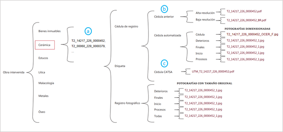
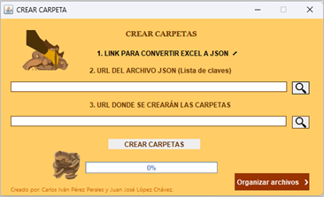
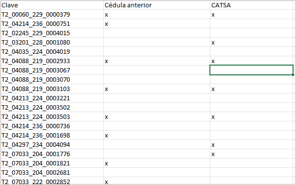
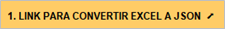
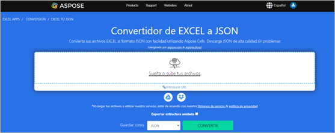
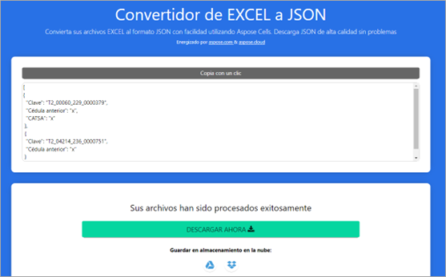
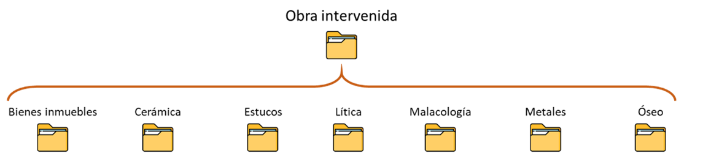
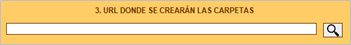

###                        MaterialesHack

# OBJETIVOS:
*MaterialesHack* está diseñado para facilitar la creación de carpetas de materiales y el acomodo de archivos dentro de éstas.

## CREAR CARPETAS

La estructura establecida para las carpetas de materiales es la siguiente: **Cerámica**, **Estucos**, **Lítica**, **Malacología**, **Metales** y **Óseo** comparten la misma estructura.

a. Dentro de cada carpeta de materiales están contenidas las respectivas carpetas de claves de excavación.  
b. La carpeta **Cédula anterior** no se encuentra dentro de todas las claves.  
c. La carpeta **Cédula CATSA** tampoco se encuentra dentro de todas las claves.

En la pantalla principal **CREAR CARPETAS**, podrás crear toda esta estructura automáticamente en segundos.  
*(IMAGEN 1, IMAGEN 2)*

### Link para convertir Excel a JSON

*MaterialesHack* necesita que indiques las cédulas de excavación de las cuáles quieres que se creen sus respectivas carpetas.

1. Crea o reutiliza un archivo Excel con **cualquier nombre**.
2. Estructura tu archivo Excel así:  
   a. Lista en la columna `Clave` todas las claves de excavación. Esto creará una carpeta por clave con la estructura mostrada en la *IMAGEN 1*.  
   b. Crea dos campos más: `Cédula anterior` y `CATSA`. Marca con una `x` (minúscula) las claves que sí contarán con éstas.  

   > **Nota:** Los campos en Excel deben llamarse exactamente: `Clave`, `Cédula anterior` y `CATSA`. Variaciones (mayúsculas o acentos) harán fallar el procedimiento.

3. Guarda tu archivo Excel y conviértelo a JSON.  
   Un JSON es un documento que se utiliza para estructurar datos. Utiliza el enlace proporcionado en el Paso 1 de la ventana principal (IMAGEN 2.) para entrar a una página que te convertirá fácilmente el archivo de Excel a JSON.

   > **Nota:** La siguiente página es ajena a MaterialesHack. Puedes utilizar cualquier otra página o método de tu preferencia para convertir el archivo XLSX (archivo de Excel) a JSON. 

a.	Arrastra y suelta o da clic en esta sección de la página para elegir tu archivo Excel creado en los puntos anteriores.

b.	Da clic al botón CONVERTIR. 

a.	Aquí puedes pre visualizar la estructura de un archivo JSON. NO ES NECESARIO que indagues en nada de esto.
b.	Simplemente dale clic al botón DESCARGAR AHORA y tendrás tu archivo listo.

### URL del archivo JSON (Lista de claves)

Una vez listo el archivo JSON, cárgalo en el apartado correspondiente. 
 
Copia y pega la dirección en tu computadora o usa el botón de búsqueda.  

> **Nota:** Solo se permiten archivos `.json`.

### URL donde se crearán las carpetas

En tu dispositivo debes tener una estructura similar a la siguiente: 

 
 
Con *MaterialesHack*, puedes generar automáticamente el contenido de cada carpeta en segundos.

Selecciona una carpeta (Cerámica, Estucos, Lítica, Malacología, Metales u Óseo).  
El programa generará la estructura para cada clave indicada en el JSON.  

> **Nota:** Si seleccionas una carpeta con nombre distinto (por acento o mayúscula), será rechazada.

 ceramica          

    

Por último, da clic en el botón para generar las carpetas automáticamente.  
Repite el proceso para cada carpeta de materiales.  

### IMPORTANTE

- Puedes crear nuevas carpetas cuando quieras, ya sea con un JSON nuevo o ampliando el existente.  
- Si alguna clave ahora incluye una cédula adicional (CATSA o anterior), repite el proceso: se añadirán las faltantes **sin afectar** lo ya creado ni los archivos existentes.

## ORGANIZAR ARCHIVOS

**ORGANIZAR ARCHIVOS** de *MaterialesHack* copiará y acomodará automáticamente todos los archivos (JPG o PDF) desde una carpeta de origen hacia las carpetas de destino.  
*(IMAGEN 6)*

### Especificaciones

Este procedimiento toma un banco de archivos de una carpeta de origen y los copia a sus respectivas carpetas de clave, siguiendo la estructura de la *IMAGEN 1*.

Ejemplo: carpeta `01_iniciales` con imágenes de claves como:

- `T2_14217_226_0000452`  
- `T2_00060_229_0000379`  
- `T2_04035_224_0004019`

Luego selecciona la carpeta de materiales donde están las claves (Cerámica, Estucos, etc.), y después la carpeta final de destino (por ejemplo: **Inicio - DIMENSIONADAS**).  

Las opciones incluyen:  

- Alta resolución (si existe)  
- Baja resolución (si existe)  
- Cédula automatizada  
- Deterioros – DIMENSIONADAS  
- Finales – DIMENSIONADAS  
- Inicio – DIMENSIONADAS  
- Procesos – DIMENSIONADAS  
- Cédula CATSA (si existe)  
- Deterioros - TAMAÑO ORIGINAL  
- Finales - TAMAÑO ORIGINAL  
- Inicio - TAMAÑO ORIGINAL  
- Procesos - TAMAÑO ORIGINAL  
- Todas - TAMAÑO ORIGINAL  

Resultado: cada imagen se copiará en automático a su lugar según la clave.  

### Pasos

1. **URL donde se encuentran los archivos**: pega la dirección o usa el buscador. *(IMAGEN 7)*  
   > No importa el nombre de la carpeta.  
2. **URL de la carpeta de material**: selecciona una carpeta válida (Cerámica, Estucos, etc.).  
   > Si tiene un nombre distinto, será rechazada.  
3. **Carpeta donde se copiarán los archivos**: elige la carpeta final (ver *IMAGEN 1*).  

Da clic en **ORGANIZAR** y espera a que se complete el proceso.  

¡Listo! Los archivos se habrán distribuido y copiado en sus respectivas carpetas.  

### Consideraciones

#### Copia de archivos
- Los archivos originales **NO se moverán ni alterarán**.  
- Siempre podrás acceder a ellos incluso después del proceso.

#### Actualiza sin riesgos
- Repetir el proceso no borrará archivos ya existentes en destino, solo añadirá los nuevos.

#### Copia solo si existen las carpetas de destino
- Si se detectan claves sin carpeta de destino, sus archivos no se copiarán. Esto se reflejará en el reporte.

### Reportes

Al organizar archivos se generará un reporte en formato `.xlsx` en la carpeta de materiales seleccionada.  
El reporte incluirá:

- **Clave**: claves detectadas en base a los archivos de origen.  
- **Estatus**: indica si la carpeta de clave ya existe (*CARPETA CREADA* o *CARPETA NO CREADA*).  
- Número de archivos en la carpeta original.  
- Número de archivos que ya estaban en destino.  
- Número de archivos nuevos en destino.  
- Total en destino tras el proceso.  
- Archivos sin copiar (carpeta inexistente).  

#### Recomendación importante: Selecciona bien la carpeta de origen

*MaterialesHack* toma los archivos y, según la carpeta final seleccionada y la nomenclatura esperada, detecta las claves.  

Ejemplo: si la carpeta final es **Cédula CATSA**, los archivos esperados deben tener formato:  

!!!
UTM_clave-de-excavación.pdf
!!!

Si el formato es distinto, puede haber errores en la detección.  

> **No te preocupes:** solo se copiarán archivos si la carpeta de clave ya existe.  
